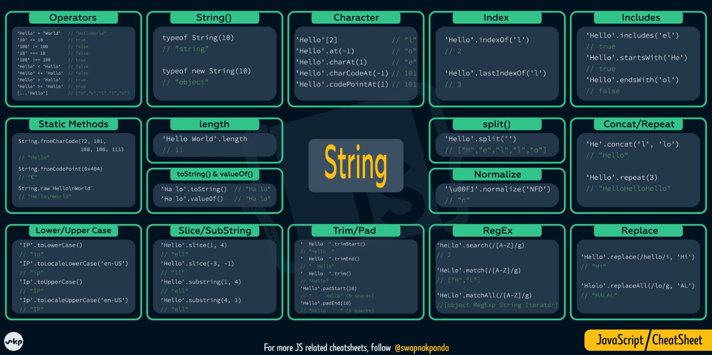
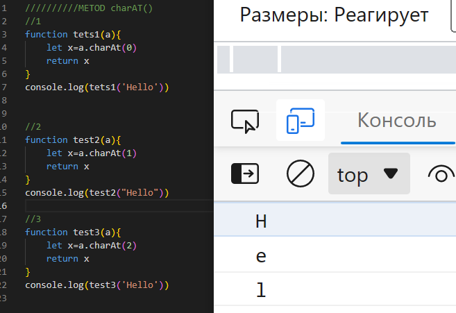

# JS_Presentation3
## What is metod in JavaScript?
> Методы JavaScript это действия, которые можно выполнить с объектами. Метод JavaScript это свойство, содержащее определение функции. Методы это функции, хранящиеся как свойства объекта.

## Create JS strings
> 

## JavaScript string methods
> 

## JavaScript String method charAt()
> JavaScript метод charAt() возвращает символ по заданному индексу внутри строки. Индекс первого символа равен нулю, а последнего рассчитывается как значение длины строки - 1 ( length - 1 ).
>

## JavaScript String method concat()
> JavaScript метод concat() используется для объединения двух, или более строк в одну, при этом метод не изменяет существующие строки, а возвращает новую строку. Если какие-либо аргументы не являются строками, то перед объединением они преобразуются в строки.
>.png)

## JavaScript String method replace()
> Метод replace() возвращает новую строку с некоторыми или всеми сопоставлениями с шаблоном, заменёнными на заменитель. Шаблон может быть строкой или регулярным выражением, а заменитель может быть строкой или функцией, вызываемой при каждом сопоставлении.
>.png)

## JavaScript String method split()
> Метод split() возвращает новый массив. Если разделитель separator найден, он удаляется из строки, а подстроки возвращаются в массиве. Если разделитель опущен, массив будет содержать только один элемент, состоящий из всей строки. Если разделитель является пустой строкой, строка str будет преобразована в массив символов.
>.png)

## JavaScript String method substr(start, length)
> - Метод substr() извлекает часть строки.
> - Метод substr() начинается с указанной позиции и возвращает указанное количество символов.
> - Метод substr() не изменяет исходную строку.
> - Чтобы извлечь символы из конца строки, используйте отрицательную начальную позицию.
>.png)

## JavaScript String method substring(start,end)
> - Метод substring() извлекает символы между двумя индексами (позициями) из строки и
возвращает подстроку.
> - Метод substring() извлекает символы от начала до конца (эксклюзивно).
> - Метод substring() не изменяет исходную строку.
> - Если start больше end, аргументы меняются местами: (4, 1) = (1, 4).
> - Начальное или конечное значения меньше 0 обрабатываются как 0.
> .png)

## JavaScript String method slice(start, end)
> Метод slice() возвращает неглубокую копию части массива в новый объект массива.
выбрано от начала до конца (конец не включен), где начало и конец представляют индекс элементов
в этом массиве
.png)

## JavaScript String method toUpperCase()
> - Метод toLowerCase() преобразует строку в строчные буквы.
> - Метод toLowerCase() не изменяет исходную строку.
> .png)

## JavaScript String method toLowerCase()
> - Метод toUpperCase() преобразует строку в прописные буквы, используя текущую локаль.
> - Метод toUpperCase() не изменяет исходную строку.
>.png)

## JavaScript String method trim()
> - Метод trim() удаляет пробелы с обеих сторон строки.
> - Метод trim() не изменяет исходную строку.
>.png)

## JavaScript String method includes()
> Метод include() возвращает true, если строка содержит указанную строку.
В противном случае он возвращает ложь.
> Метод include() чувствителен к регистру.
>.png)

## JavaScript String method search()
> - Метод search() сопоставляет строку с регулярным выражением **
> - Метод search() возвращает индекс (позицию) первого совпадения.
> - Метод search() возвращает -1, если совпадений не найдено.
>.png)

## JavaScript String method toString()
> Метод toString() возвращает строку, представляющую объект.
> По умолчанию toString() не принимает параметров.
>.png)

## JavaScript String method repeat()
> repeat() Метод repeat() конструирует и возвращает новую строку, содержащую указанное количество соединённых вместе копий строки, на которой он был вызван.
>.png)
>
>
>
>
>
>
>
>